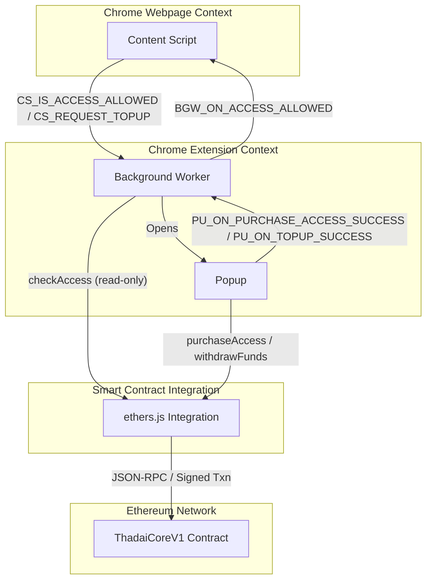

<p align="center">
   
</p>

# Thadai Chrome Extension

A productivity-focused Chrome extension that blocks distracting websites and uses a smart contract as an access control engine. Users must purchase access time through the blockchain to unblock restricted sites, creating a financial incentive to stay focused.

## Overview

Thadai Chrome Extension interfaces with websites and interacts with the **ThadaiCoreV1** smart contract to determine whether a user has access to blocked websites. The extension blocks access to distracting sites by default, and users can purchase temporary access by sending ETH to the smart contract.

## How It Works

1. **Website Blocking**: The extension monitors visited websites and blocks access to configured distracting sites (e.g., Facebook, X/Twitter, Instagram, Reddit, YouTube).

2. **Access Control**: When a user visits a blocked website, the extension checks the ThadaiCoreV1 smart contract to verify if the user's wallet address has active access.

3. **Access Purchase**: If access is not available, users can purchase access time by sending ETH to the smart contract through the extension's popup interface.

4. **Automatic Unblocking**: Once access is purchased and confirmed on-chain, the extension automatically unblocks the website for the duration of the purchased access time.

## Features

- 🔒 **Automatic Website Blocking**: Blocks distracting websites to improve productivity
- 💰 **Blockchain-Based Access Control**: Uses smart contracts for decentralized access management
- ⏱️ **Time-Based Access**: Purchase access for specific durations
- 🔄 **Real-Time Access Checking**: Continuously verifies access status from the smart contract
- 💳 **In-Extension Payments**: Purchase access directly from the extension popup

## Architecture

The Thadai Chrome Extension is organized into four main components, each separated by Chrome's security boundaries:

- **Content Script** (runs in the web page context, isolated from extension code)
- **Background Worker** (service worker, orchestrates access control and messaging)
- **Popup** (UI for purchasing access and withdrawing funds)
- **ThadaiCoreV1 Smart Contract** (modular access control engine on Ethereum)

Below is a detailed flowchart showing boundaries, message flows, and modularity:



**Message Flow:**
- Content Script → Background Worker: Access check and top-up requests (CS_IS_ACCESS_ALLOWED, CS_REQUEST_TOPUP)
- Background Worker → Content Script: Access allowed notification (BGW_ON_ACCESS_ALLOWED)
- Background Worker → Popup: Opens popup for user action
- Popup → Background Worker: Purchase/top-up success notification (PU_ON_PURCHASE_ACCESS_SUCCESS, PU_ON_TOPUP_SUCCESS)
- Background Worker → Ethers.js Integration: Queries access status (read-only)
- Popup → Ethers.js Integration: Signs and broadcasts transactions (purchase access, withdraw funds)
- Ethers.js Integration → Smart Contract: JSON-RPC calls and signed transactions

**Chrome Security Boundaries:**
- Web Page Context is fully sandboxed from the extension.
- Extension Contexts (background worker, popup) are isolated from the web page and communicate only via message passing.

**Modularity:**
The integration layer (`src/core/eth/`) is swappable; replacing the smart contract engine only requires updating this layer.

## Smart Contract Integration

The extension integrates with the **ThadaiCoreV1** Ethereum smart contract for access control. It uses the [ethers.js](https://docs.ethers.org/) library to:

- Check if a user's wallet address has active access to blocked sites by calling `checkAccess` on the contract.
- Allow users to purchase access time by sending ETH to the contract via `purchaseAccess`.
- Query access pricing and withdrawal cooldowns using contract view functions.
- Withdraw funds (if eligible) from the contract.

All contract configuration (RPC URL, contract address, user private key) is managed in the extension's settings UI and stored securely in Chrome local storage.

## Setup

### Prerequisites

- Node.js >= 14.18.0
- Chrome browser (for extension usage and testing)
- [Foundry](https://book.getfoundry.sh/) (for local smart contract deployment/testing)

### Installation

1. Clone this repository:
   ```sh
   git clone https://github.com/dev-vim/thadai-chrome-extension.git
   cd thadai-chrome-extension
   ```
2. Install dependencies:
   ```sh
   npm install
   ```
3. Build the extension:
   ```sh
   npm run build
   ```
4. Load the extension in Chrome:
   - Go to `chrome://extensions` and enable "Developer mode"
   - Click "Load unpacked" and select the `build/` directory

### Configuration

1. Click the extension icon and open the settings (gear icon).
2. Enter the following details:
   - **Private Key**: Your Ethereum wallet private key (used for signing transactions)
   - **Blockchain Name**: e.g. "Ethereum Mainnet" or "Anvil Local"
   - **Blockchain ID**: e.g. `1` for mainnet, `31337` for Anvil
   - **Blockchain RPC URL**: e.g. `https://mainnet.infura.io/v3/xxx` or `http://localhost:8545`
   - **Thadai Contract Address**: The deployed ThadaiCoreV1 contract address
3. Save settings. The extension is now ready to use.

## Usage

1. By default, the extension blocks access to distracting websites (e.g., Facebook, Instagram, Reddit, YouTube).
2. When you visit a blocked site, a message is shown with an option to purchase access.
3. Use the popup to select the amount of ETH to spend and duration of access, then confirm the transaction.
4. Once the transaction is confirmed on-chain, the site is unblocked for the purchased time.
5. You can withdraw unused balance (if eligible) from the popup.
6. Manage blocked sites and blockchain settings from the extension's settings page.

## Security Notes

- **Private Key Storage**: The extension stores your private key in Chrome local storage. For best security, use a dedicated wallet with limited funds.
- **Blockchain Transactions**: All access purchases and withdrawals are on-chain and require ETH for gas.
- **No Server-Side Storage**: All logic and data are handled client-side or on-chain; no user data is sent to external servers.
- **Risks**: If your private key is compromised, funds in the associated wallet may be at risk. Never reuse a primary wallet.

## Related Projects

- **ThadaiCoreV1 Smart Contract**: The access control engine contract.
- **Thadai Events Watcher**: Couple of scripts to monitor contract events and log access purchases/withdrawals.
